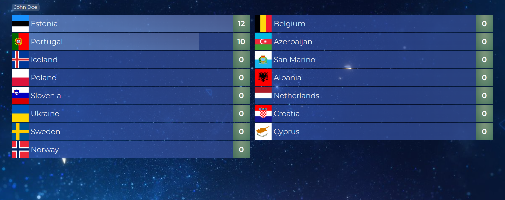
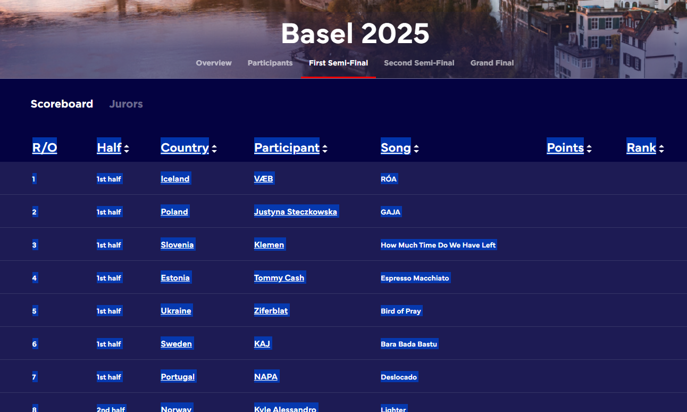

# Eurovote
Socket.io live voting tool for showing on a second screen.



## Configuration
Please fill in `src/acts.ts`, i.e.:
```
const acts: { [number: number]: Act } = {
    1: { country: "Iceland", contestant: "VÆB", song: "RÓA" },
    2: { country: "Poland", contestant: "Justyna Steczkowska", song: "GAJA" }
};

export default acts;
```

### Generate data

You can generate the data based on the Eurovision scheme from eurovision.tv with this AI-command prompt:

```
I have this interface:
`Act { country: string; contestant: string; song: string; }`.
I need to fill this const in acts.ts:
`const acts: { [number: number]: Act }`.
Can you fill this typescript object called acts with the data from this table?

<<SELECT TABLE DATA FROM WEBSITE, COPY, AND PASTE HERE>>
```

You can just select the table in the browser and copy it.



## Running the server
1. Make sure node modules are installed by running `npm ci`.
2. Run `npm run start`
3. Open your browser at `localhost:8000`
